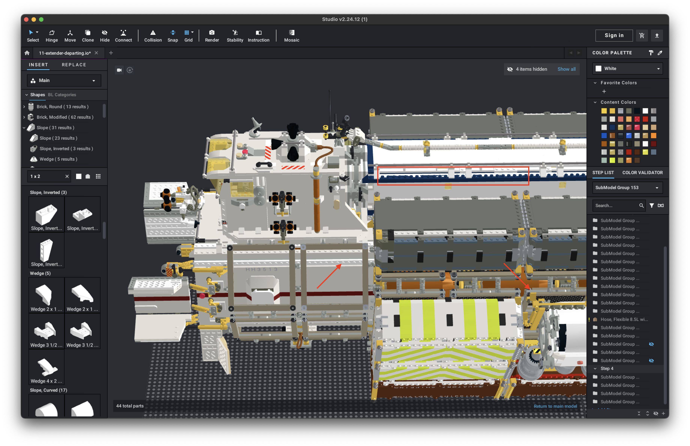

# 28192 😡

[home](README.md)

Piece [28192](https://www.bricklink.com/v2/catalog/catalogitem.page?P=28192&C=1#T=C&C=1), or **Slope 45 2 x 1 with
Cutout without Stud**, is one of my favorite elements to build with.  As a kid I always wanted a piece like 28192 and
its siblings, [92946](https://www.bricklink.com/v2/catalog/catalogitem.page?P=92946&C=1#T=C&C=1) and 
[2310](https://www.bricklink.com/v2/catalog/catalogitem.page?P=2310&C=1#T=C&C=1).  In early Dec 2024 the geometry of 
this part was updated and _nearly all_ of my models were...severely impacted (understatement).  It took several evenings
using the **Select | By Type** tool in Studio to find, delete, and replace all instances of 28192 for the small number
of MOCs I plan to re-use in the near future.  On the flip side, this incident did make me introduce
[5540](https://www.bricklink.com/v2/catalog/catalogitem.page?P=5540#T=C) everywhere to reduce my dependency on 28192.

Here's an example of what happened on the Extender and cargo containers;
note the red markup for just a few of the impacted areas:

[home](README.md)
