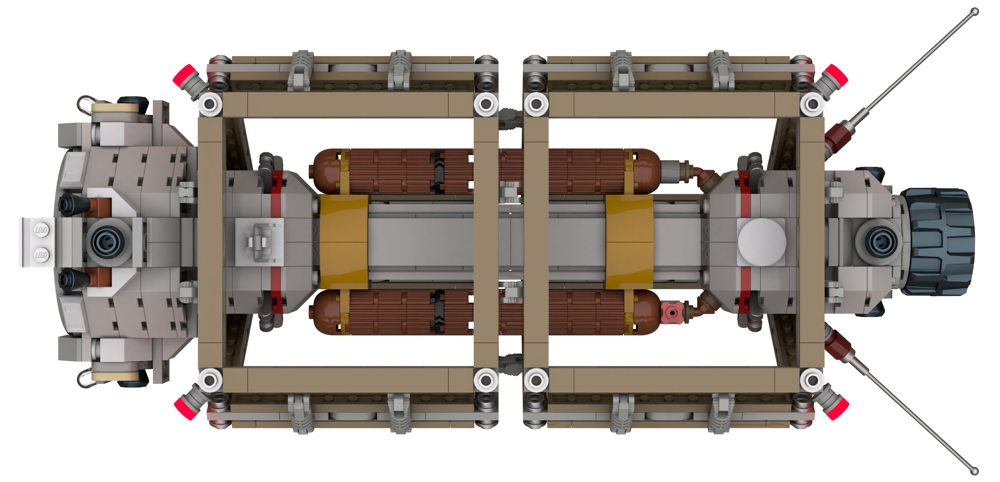
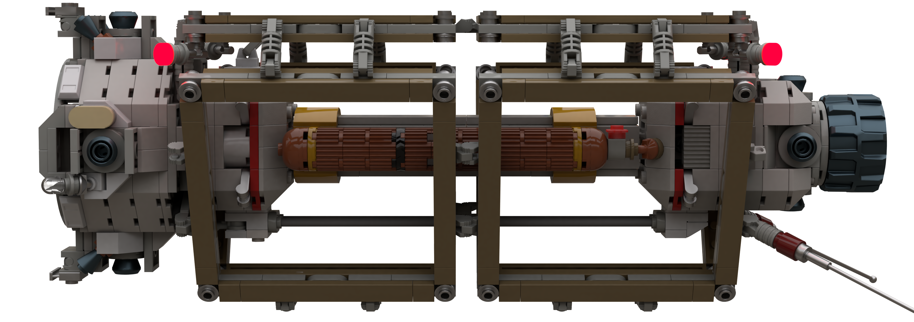
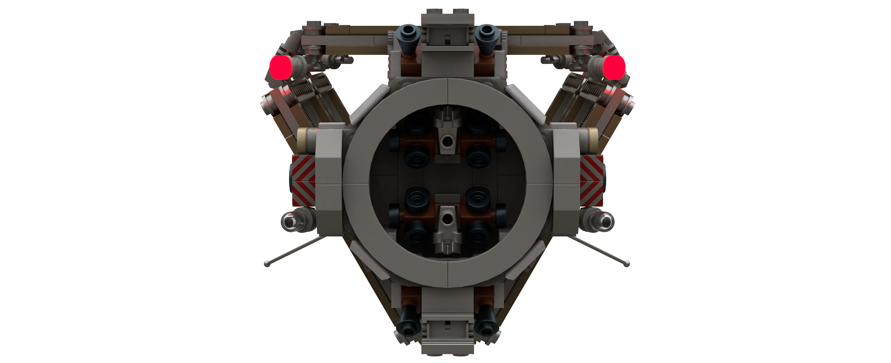

# Drone Transporter

[home](../README.md)

**Model**: [`drone-transporter.io`](./drone-transporter.io) (NOTE: this file may contain 28192 artifacts)

| Specification | Value | Metric |
|---------------|-------|--------|
| Purpose | Medium range autonomous cargo delivery between nearby planets ||
| Piece Count | approx. 800 ||
| Length | 41.6 studs | 33.3 cm |
| Width | 22.7 studs | 18.1 cm |
| Height | 15.2 studs | 12.1 cm |
| External Cargo Volume | 3x standard containers ||
| Crew | Uncrewed ||

[home](../README.md)