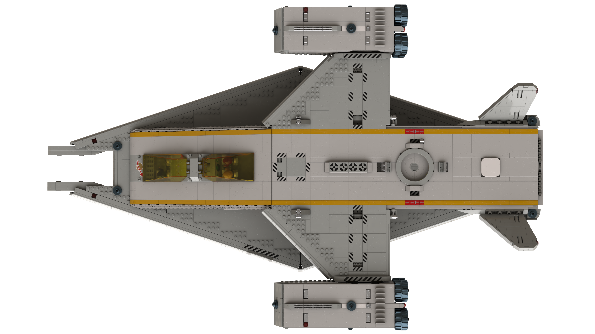
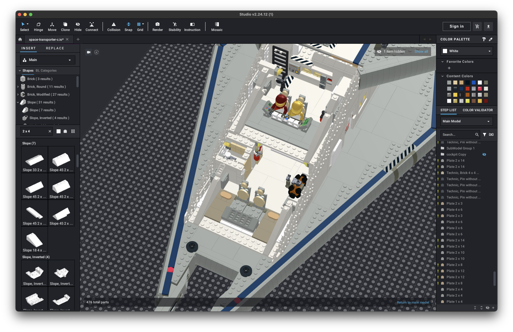
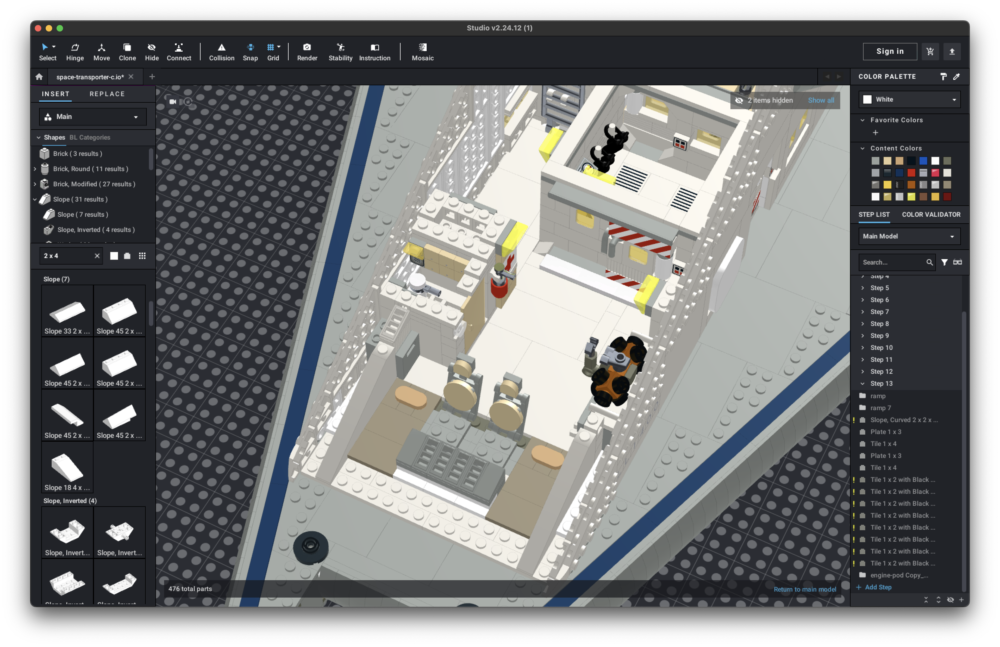
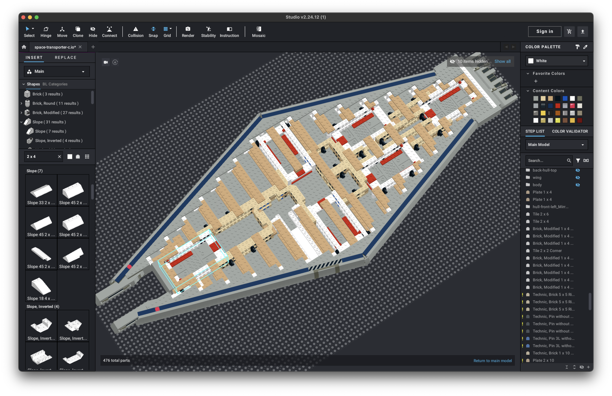

# Space Transporter (A)

[home](../README.md)

**Model**: [`space-transporter-a.io`](./space-transporter-a.io) (NOTE: this file may contain 28192 artifacts)

| Specification | Value | Metric |
|---------------|-------|--------|
| Purpose | Short range cargo delivery between atmospheric planets and their moons ||
| Piece Count | approx. 5,300 ||
| Length | 108.2 studs | 86.5 cm |
| Width | 69 studs | 55.2 cm |
| Height | 27.6 studs (landing gear retracted) | 22.1 cm |
| Height | 45 studs (landing gear extended, engines positioned for VTOL) | 36 cm |
| Cargo Volume | 54 deep x 12 wide x 10 high studs or 2x standard containers ||
| Crew | 2 - 4 ||

## Author's Notes
This ship was my first big project in Studio and wouldn't have been possible without learning the techniques of the new
Galaxy Explorer.  I wanted to build something big, but also capture the 30 and 45-degree angles used on early Classic
Space ships.  The sketch below made it all come together: a 45-degree angle or the high wing, and then a 30-degree lower
hull.  The VTOL engines were inspired from modern-day aircraft like the
[V-22](https://en.wikipedia.org/wiki/Bell_Boeing_V-22_Osprey) and [AW609](https://en.wikipedia.org/wiki/Leonardo_AW609).

## Highlights
* The landing gear, ramp, stairs, and top antennas all cleanly retract inside of the ship.
* There is a functional interior inside the ship.
* The airlock provides access to the cargo bay and exterior stairs.
* The top docking clamp has been incorporated into most subsequent MOCs so the ships can interoperate.
* The RCS (metallic-black thrusters on the engine pods and body) should provide
[six degrees of freedom](https://en.wikipedia.org/wiki/Six_degrees_of_freedom).
* The crew is envisioned to be a pilot / Captain, pilot / First Officer, and one or two cargo handlers.
* I've continued to use LEGO's `LL` numbering convention.  This ship, #3171 is a reference to 'C' (letter 3), 17, 'A'
(letter 1) or [C-17A](https://en.wikipedia.org/wiki/Boeing_C-17_Globemaster_III).  Originally I thought about naming
this ship class the "Starmaster" but settled on a more generic "Space Transporter" instead.

## Studio Shots

The flight deck of the ship with controls in the rear for cargo management:

The lower deck of the ship with room for the two cargo specialists, sleeping areas on the floor, a bathroom, misc
storage, and an EVA unit:

The interior of the ship's hull: when I build moveable sections (landing gear, ramps, stairs, etc.) I generally create
three different objects: one - extended, two - retracted, and three - "empty".  You can see the landing gear and stair
areas are "empty" to keep model complexity down when those features aren't visible in a scene:

[home](../README.md)