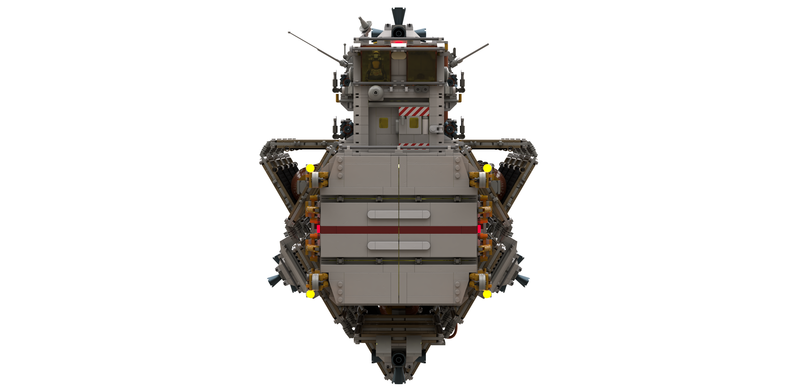

# Space Transporter Extender

[home](../README.md)

## Models
* [`space-transporter-extender.io`](./space-transporter-extender.io): NOTE: This file may contain 28192 artifacts.
* [`extender-er.io`](./extender-er.io): Enhancements include inverted engine pods for better cargo management and 33%
additional range over the base mode.
* [`extender-lr-dse.io`](./extender-lr-dse.io): Enhancements include uprated engines, 25% increased range over the ER,
retractable bow RCS pods, and deep space capabilities for used on [`RP-01`](../vignettes/rp-01/README.md).

## Specifications
| Specification | Value | Metric |
|---------------|-------|--------|
| Purpose | Long range cargo delivery within a stellar system to deep space transport (later models) ||
| Piece Count | approx. 8,200 ||
| Length | 120.5 studs | 96.4 cm |
| Width | 54.8 studs | 43.8 cm |
| Height | 55 studs | 44 cm |
| Internal Cargo Volume | 98 deep x 16 wide x 16 high studs ||
| External Cargo Volume | 25x containers  each able to hold 23 deep x 8 wide x 8 high ||
| Crew | 2 ||

## Renders

[home](../README.md)