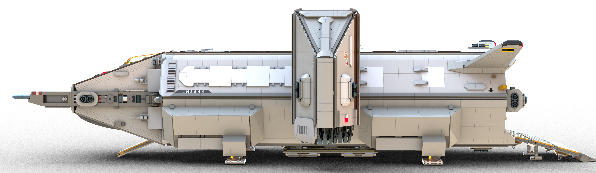
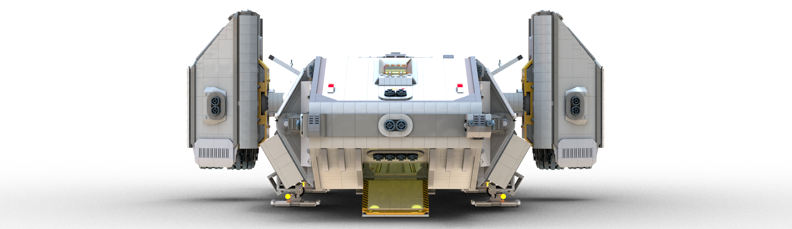

# Dropshop (aka The Boar)

[prev](../README.md)

| Specification | Value | Metric |
|---------------|-------|------|
| Purpose | Very short range heavy cargo delivery between atmospheric planets and their moons ||
| Piece Count | approx. 11,300 ||
| Length | 137.6 studs | 110.1 cm |
| Width | 94 studs | 75.2 cm |
| Height | 34.1 studs (landing gear retracted) | 27.3 cm |
| Height | 47.5 studs (landing gear extended, engines positioned for VTOL) | 38 cm |
| Cargo Volume | 84 deep x 28 wide x 19.8 high studs or 6x standard containers ||
| Crew | 2 - 4 ||

[prev](../README.md)