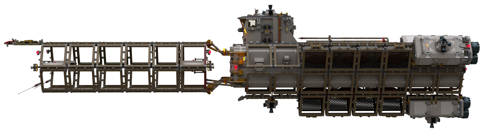
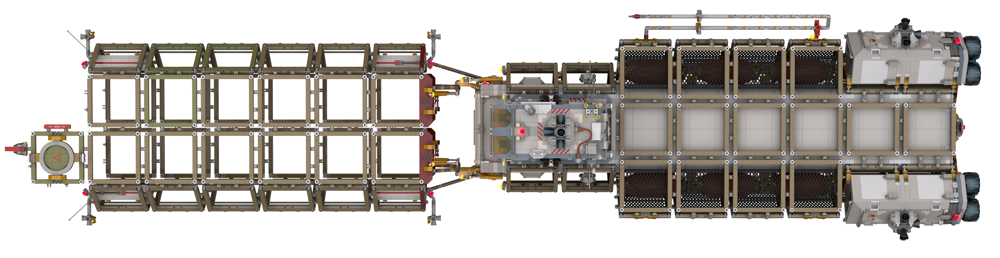

# Extender (ER) with Carge Barge

[prev](../README.md)

| Specification + | Value | Metric |
|-------------------|-------|------|
| Purpose | Very long range cargo delivery within a stellar system ||
| Piece Count | approx. 11,000 ||
| Length | 223.6 studs | 178.9 cm |
| Width | 56.8 studs | 45.4 cm |
| Height | 60.2 studs | 48.1 cm |
| Internal Cargo Volume | 98 deep x 16 wide x 16 high studs ||
| External Cargo Volume | 61x standard containers ||
| Crew | 2 ||

[prev](../README.md)