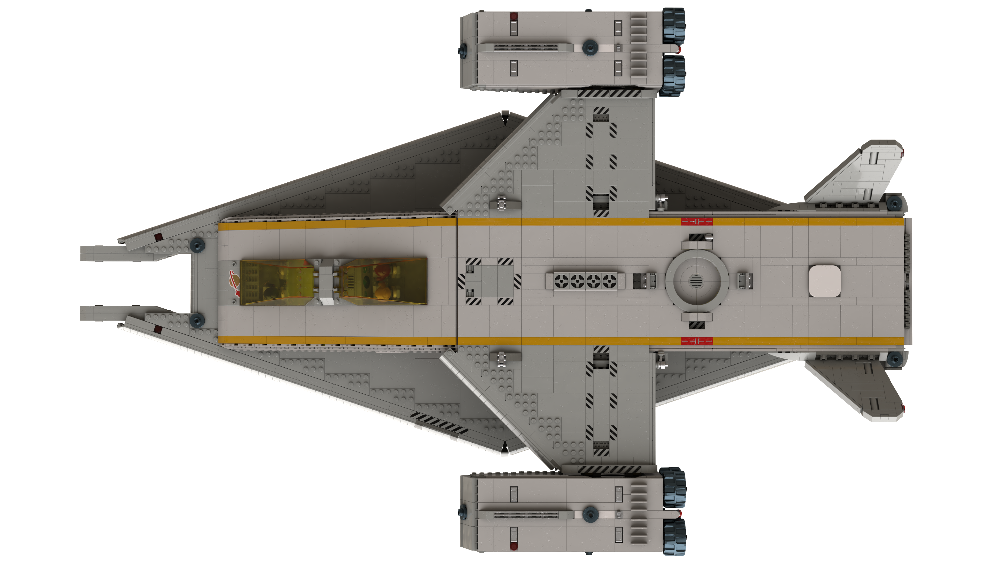
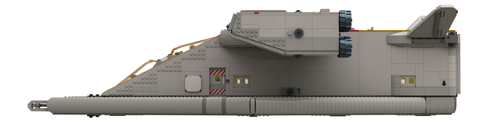

# Space Transporter A

[home](../README.md)

| Specification | Value | Metric |
|---------------|-------|--------|
| Purpose | Short range cargo delivery between atmospheric planets and their moons ||
| Piece Count | approx. 5,300 ||
| Length | 108.2 studs | 86.5 cm |
| Width | 69 studs | 55.2 cm |
| Height | 27.6 studs (landing gear retracted) | 22.1 cm |
| Height | 45 studs (landing gear extended, engines positioned for VTOL) | 36 cm |
| Cargo Volume | 54 deep x 12 wide x 10 high studs or 2x standard containers ||
| Crew | 2 - 4 ||

[home](../README.md)