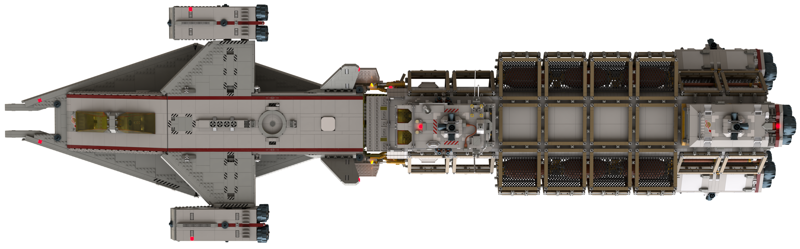
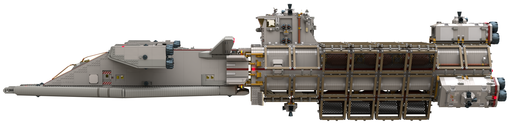

# Space Transporter B with Extender

[prev](../README.md)

| Specification + | Value | Metric |
|-------------------|-------|------|
| Purpose | Medium range cargo delivery within a stellar system, and range extension of atmospheric-capable ships ||
| Piece Count | approx. 13,300 ||
| Length | 228.6 studs | 182.9 cm |
| Width | 69 studs | 55.2 cm |
| Height | 55 studs | 44 cm |

[prev](../README.md)