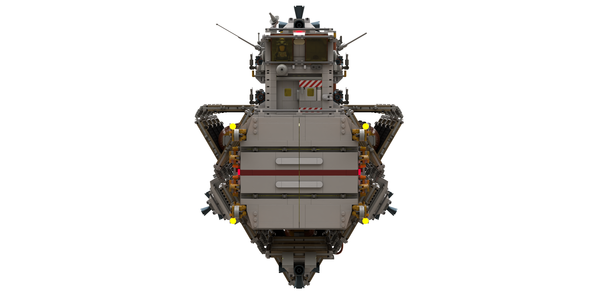

# Space Transporter Extender

[home](../README.md)

| Specification | Value | Metric |
|---------------|-------|--------|
| Purpose | Long range cargo delivery within a stellar system ||
| Piece Count | approx. 8,200 ||
| Length | 120.5 studs | 96.4 cm |
| Width | 54.8 studs | 43.8 cm |
| Height | 55 studs | 44 cm |
| Internal Cargo Volume | 98 deep x 16 wide x 16 high studs ||
| External Cargo Volume | 25x containers  each able to hold 23 deep x 8 wide x 8 high ||
| Crew | 2 ||

[home](../README.md)