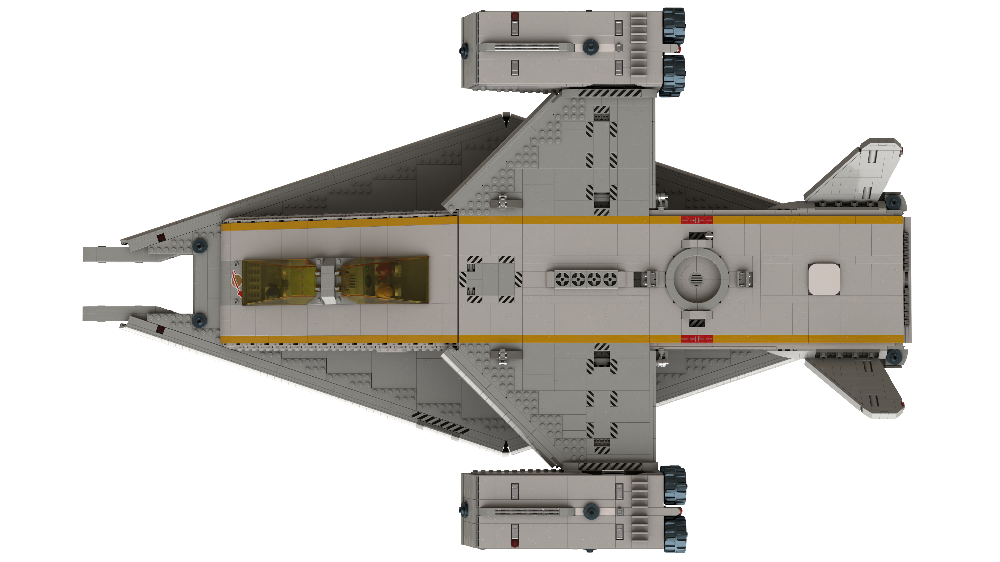

# Space Transporter

[prev](../README.md) [next](01-landing-pad.md)

| Specification | Value |
|---------------|-------|
| Piece Count | approx. 5300 |
| Length | 108.2 studs |
| Width | 69 studs |
| Height | 27.6 studs (landing gear retracted) |
| Height | 32.6 studs (landing gear extended) |
| Cargo Volume | 54 deep x 12 wide x 10 high studs |

[prev](../README.md) [next](01-landing-pad.md)