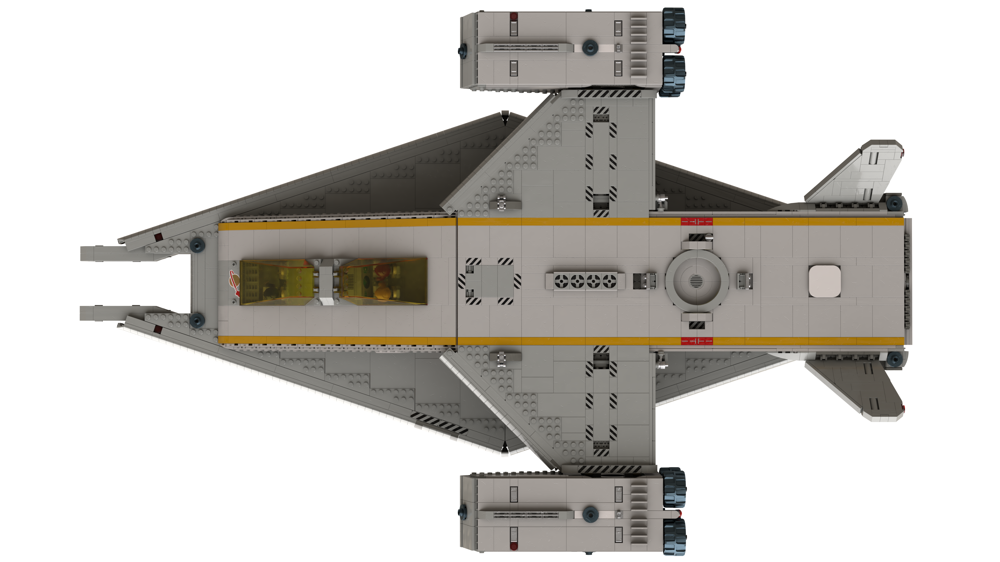

# Space Transporter

[prev](../README.md) [next](01-landing-pad.md)

| Specification | Value | Metric * |
|---------------|-------|--------|
| Piece Count | approx. 5300 ||
| Length | 108.2 studs | 37.7m |
| Width | 69 studs | 24m |
| Height | 27.6 studs (landing gear retracted) | 9.6m |
| Height | 45 studs (landing gear extended, engines positioned for VTOL) | 15.7m |
| Cargo Volume | 54 deep x 12 wide x 10 high studs ||

\* metric dimensions based on [Dave's Lego Scale Converter](http://www.suave.net/~dave/cgi/scale.cgi) and a scale of `1 : 43.54`

[prev](../README.md) [next](01-landing-pad.md)