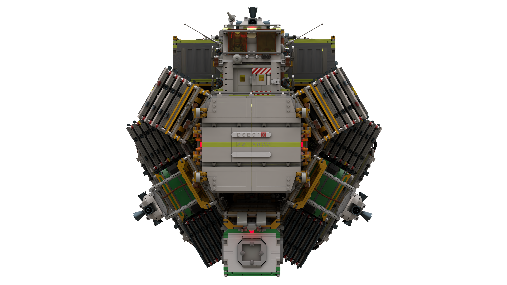
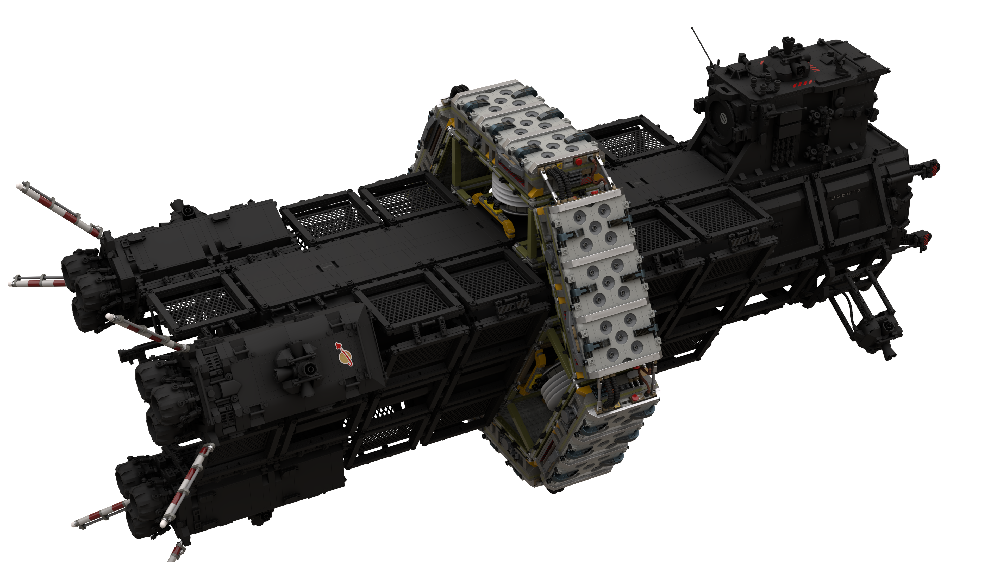

# LSS Argo Walkthrough

[back](../README.md)

## LSS Argo, DSE01`X` (Extender LR, experimental.  Formerly DSE01A)

## Clean

## Space Fold Generator (prototype) and Subspace Antenna Array

## Interior

[back](../README.md)
