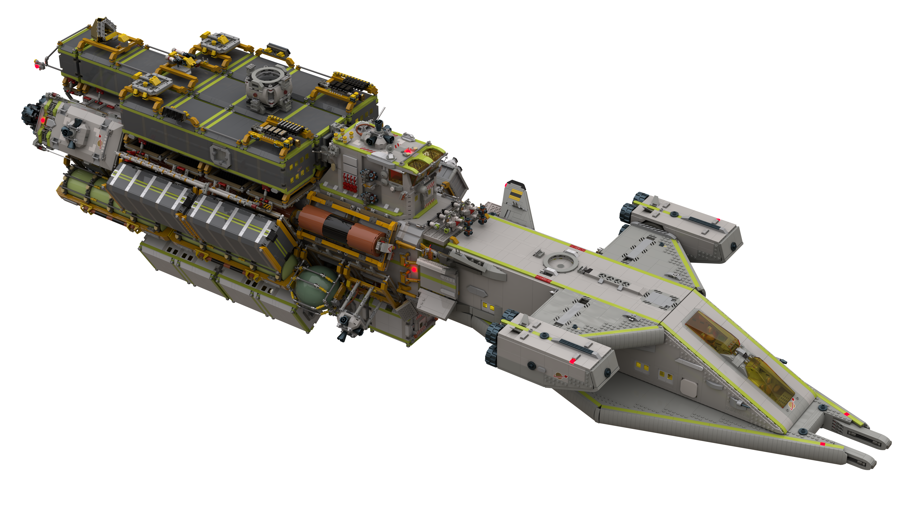
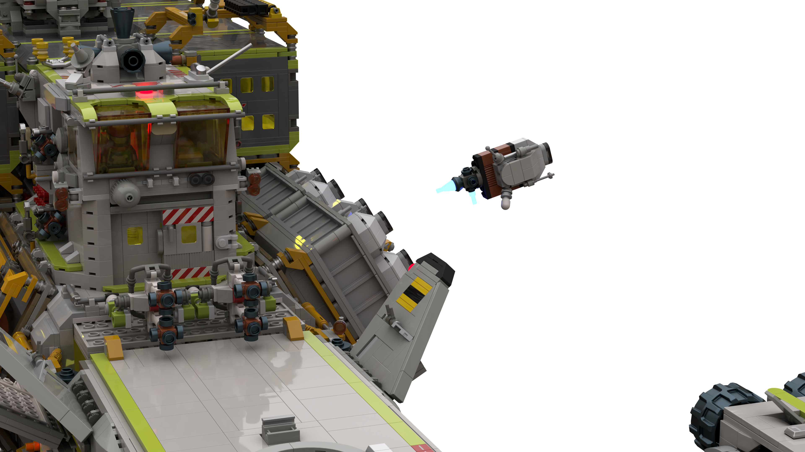
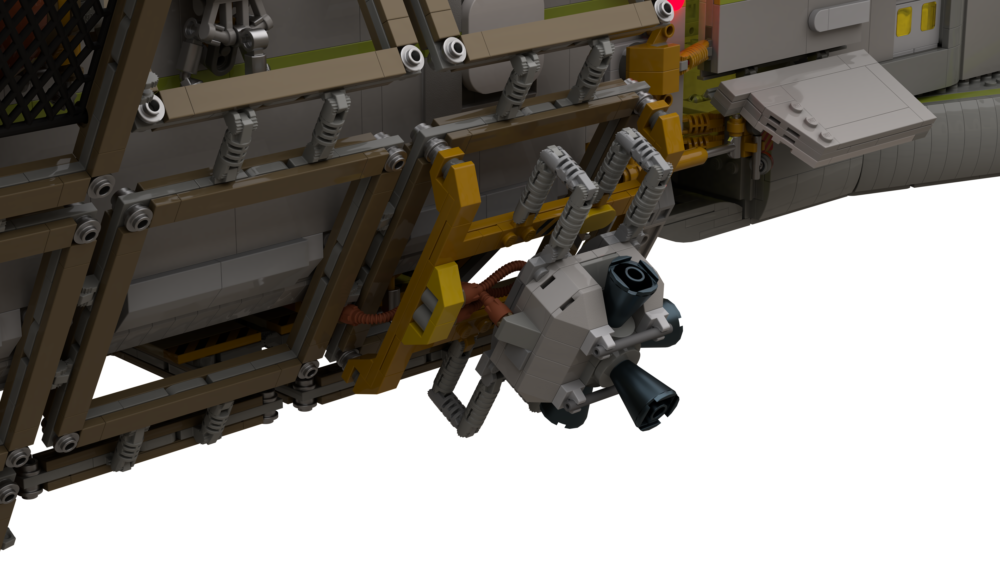
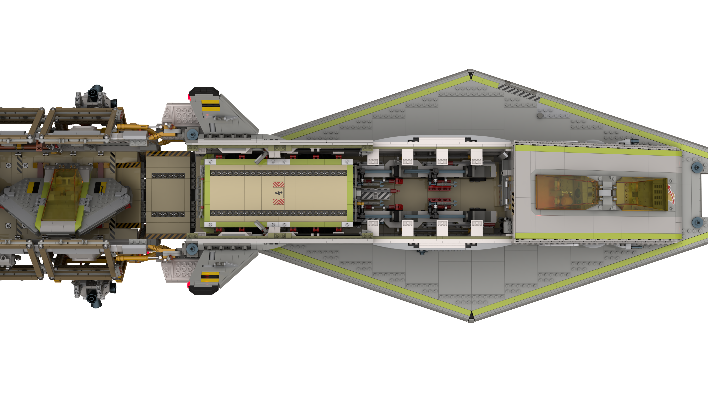

# Deep Space Explorer 01 Walkthrough

[back](../dse-01-and-the-red-planet.md)

## Perspective

## Sensors Unfurling 

<!--
Engine Antennas x2:
1. rotate out 45
2. rotate out 90
3. rotate out 135
4. rotate up 45

Petal Antenna:
1. arm negative -> 45, petal level
2. arm -> 90, petal level
3. petal opens
4. petal -> 45
5. base rotate 45

Radar x2:
1. arm -> 45
2. arm -> 90
3. radar -> 45
4. base rotate 45

Camera:
1. arm negative -> level, camera level
2. arm -> 45, camera level
3. camera arms straighten
4. camera -> 45
5. base rotate 45

Gas Collectors x2:
1. arm -> 27, collector level
2. arm -> 54, collector level
3. arm -> 81, collector level
4. arm -> 108, collector level
5. arm -> 135, collector level
-->

## Probe Launch
<!--
1. Zoom in
2. Ejection
3. Unfold and ignition
-->

## Teardown
<!--
1. Hide everything attached to top modules
2. Hide top modules
4. Hide all containers and adapters
-->

## Bow Lower RCS Stowed

## Ships' Internal Cargo Bays

[back](../dse-01-and-the-red-planet.md)