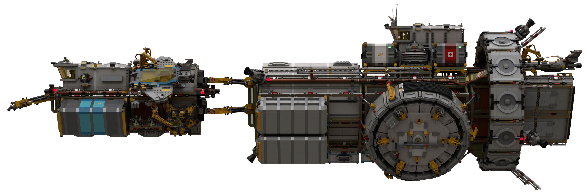
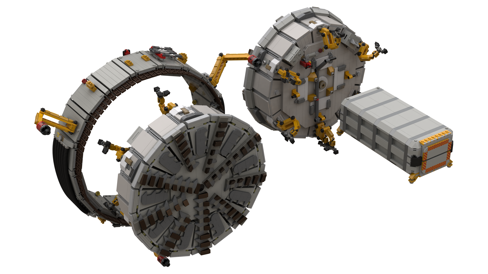
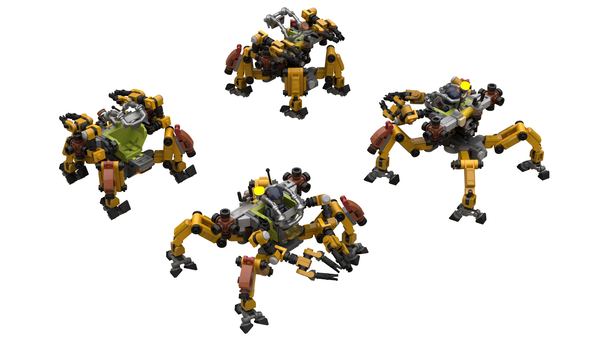

# Astreus Station, Erimos Asteroid Belt (`ES-09`)

[home](../../README.md)

## LSS Hermes (Extender Neo) and LSS Erebus (Tender Neo)

## Erebus Placing Initial Frames

## Undocking the Tunnel Boring Machine from the Hermes

## Positioning the Tunnel Boring Machine against Astereus Minor

## Phase I of Station Completed with Phase II Boring Commenced

## Transfer of Command from Zephyr to Hermes over Erimos IV

## Tunnel Boring Machine (TBM)

## Centaur with RCS Unit

[home](../../README.md)
