# Build Sequence

[back](../README.md)

## Docking Module Repositioned
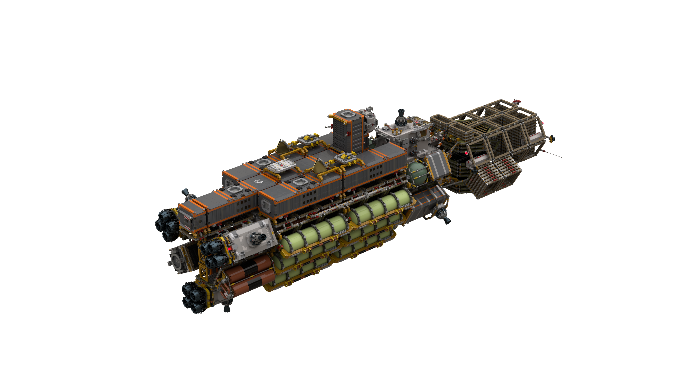

## Side 3 (Habitation Modules) Connected
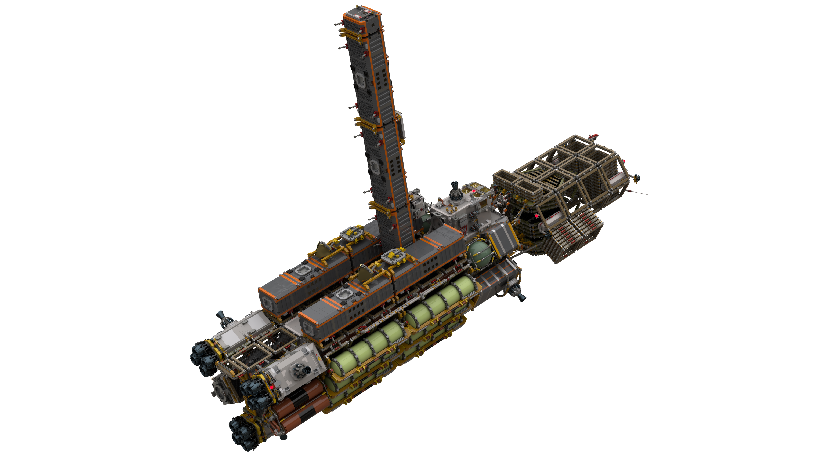

## Module Frames Installed
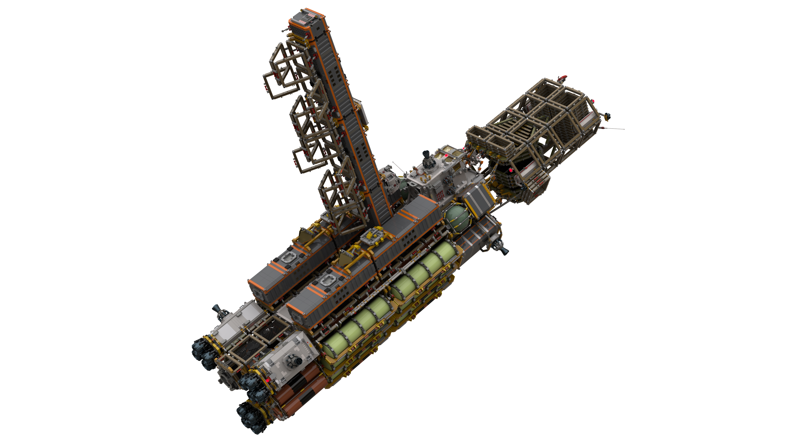

## Module Y-Adapters Connected
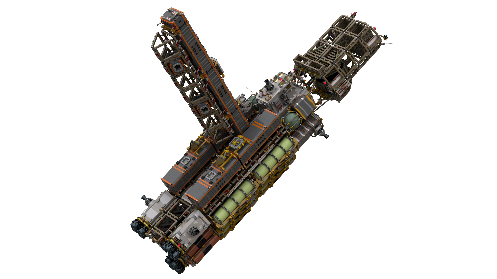

## Sides 1, 2 Modules Connected
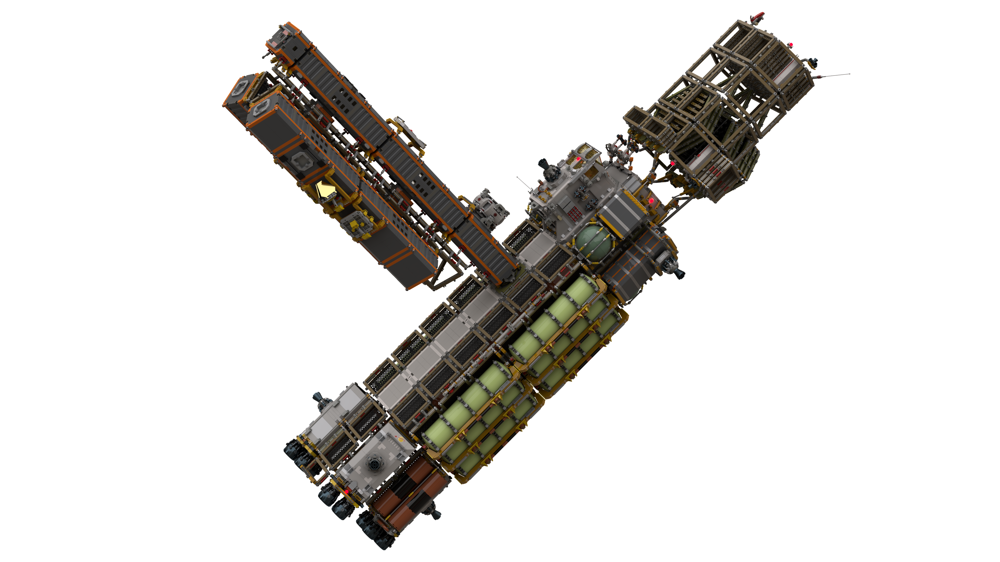

## Command and Docking Modules Connected
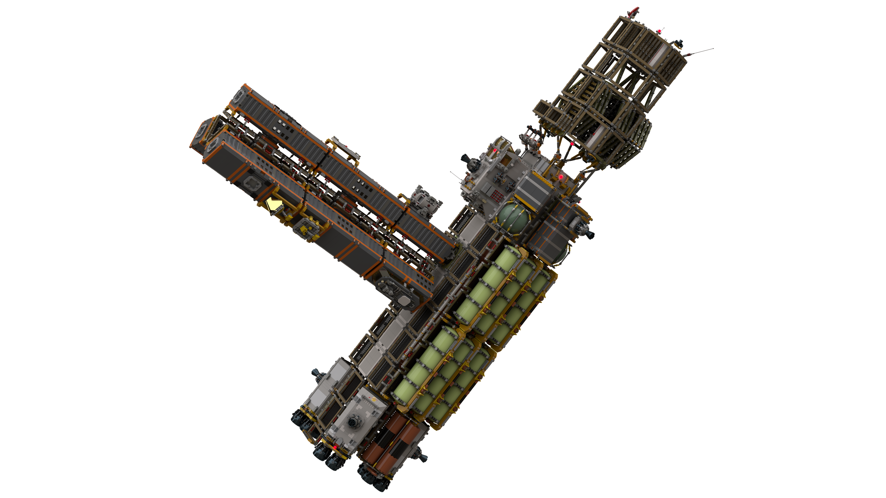

## Sensor Ring and Reactor Installed
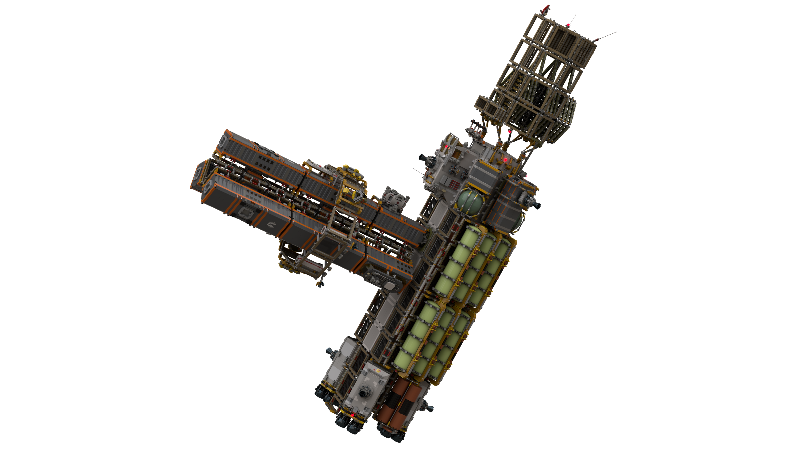

## Separation
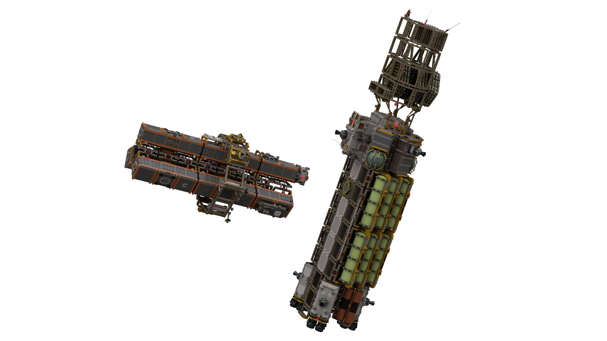

## Return Module Repositioned
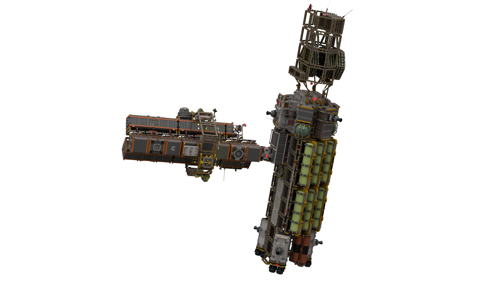

## Tank Frames Installed
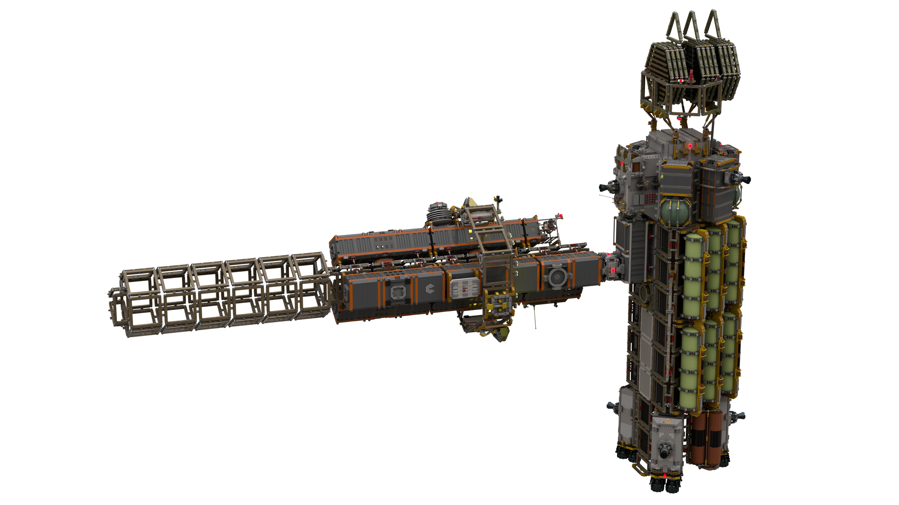

## Tanks and Refueling Boom Installed
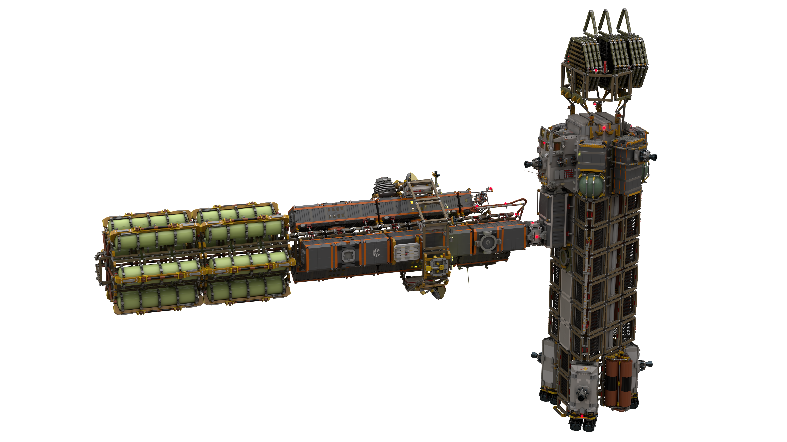

## Solar Panels Installed
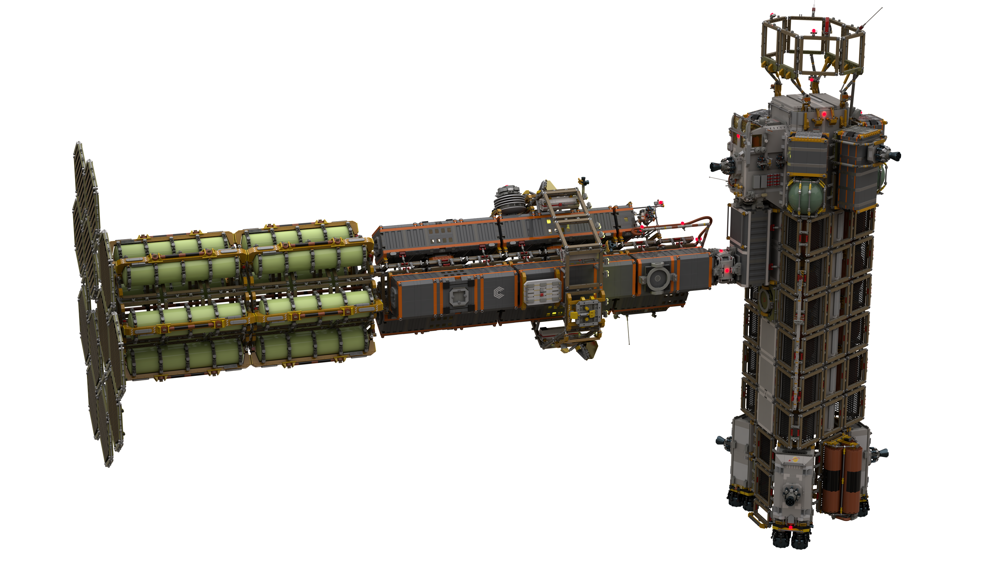

## Life Support Tanks and Arm Installed
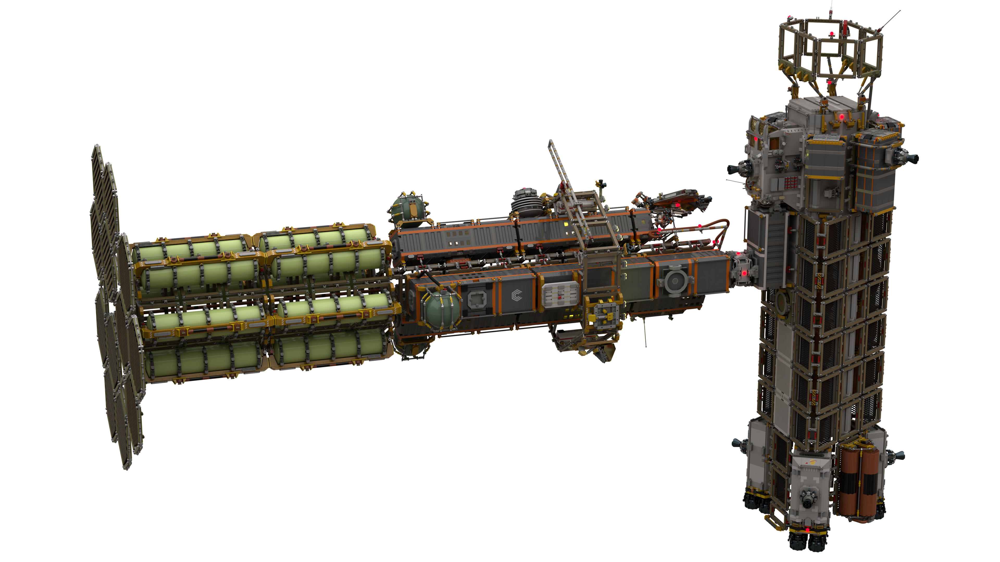

[back](../README.md)
