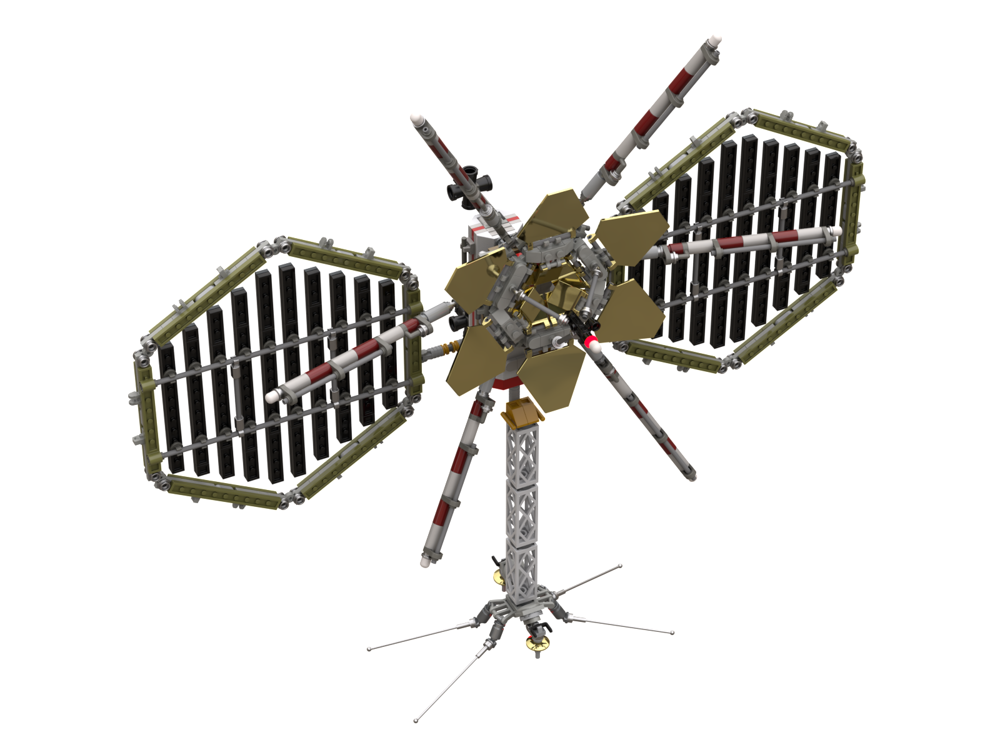
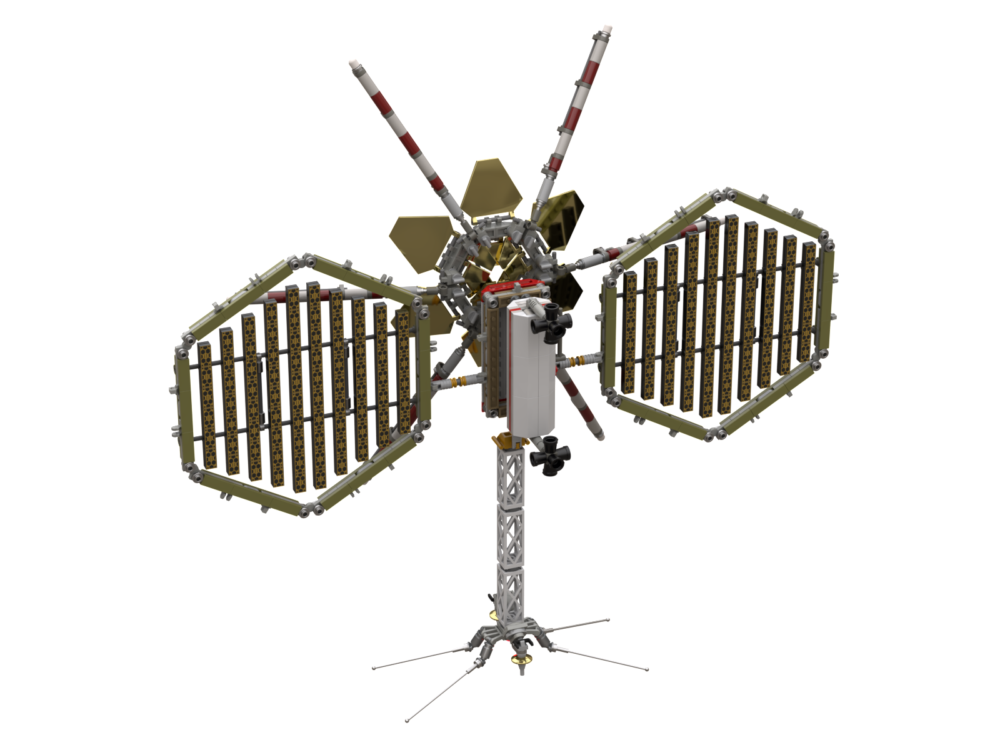

# Red Planet Mission 06 Space Renders

[back](../README.md)

## LSS Æther, DSE03`X` (Extender ULR, experimental.  Formerly HH1024)

## Interior and External Pod Shots

## Clean

## Space Fold Generator (prototype v3) with integrated Subspace Antenna Array

## Modified Bridge with Custom Pass-thru Tunnel and Docking Module

## Lagrange Point 2 Primary Subspace Antenna and Communications Relay 

## Returning Home

[back](../README.md)
