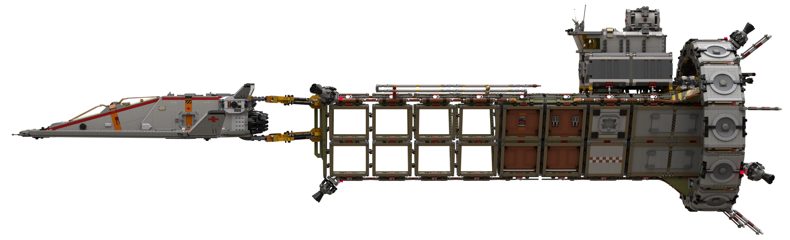
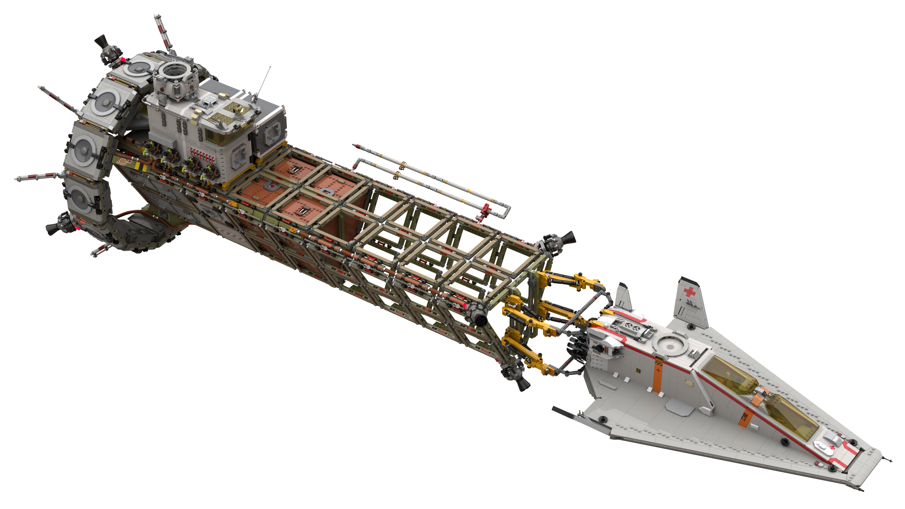

# Red Planet Mission 07 Preparation and the LSS Zephyr (`RP-07-pre`)

[home](../../README.md)

## LSS Zephyr, DSE04 (Extender Neo)

## Clean

## Falcon disconnecting from Docking Mandibles

## Falcon docking with LSS Zephyr

[home](../../README.md)