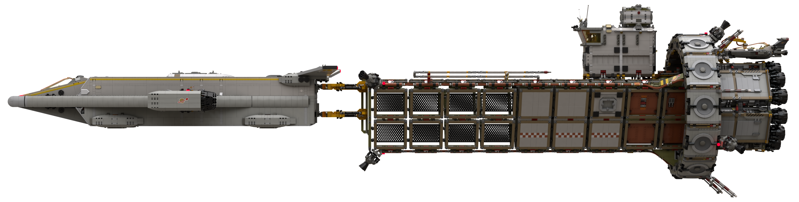
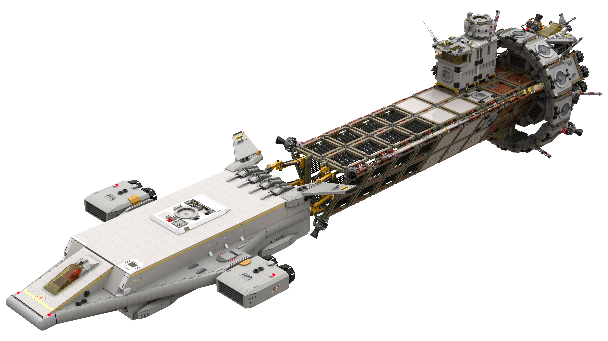
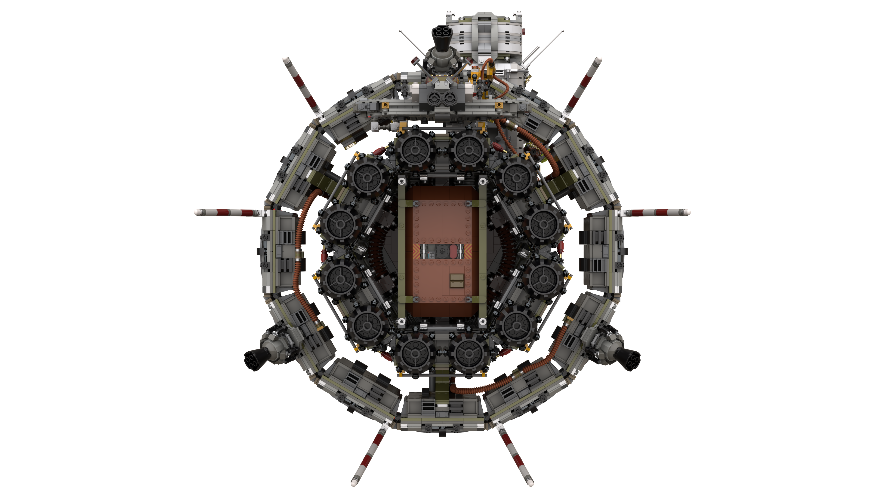
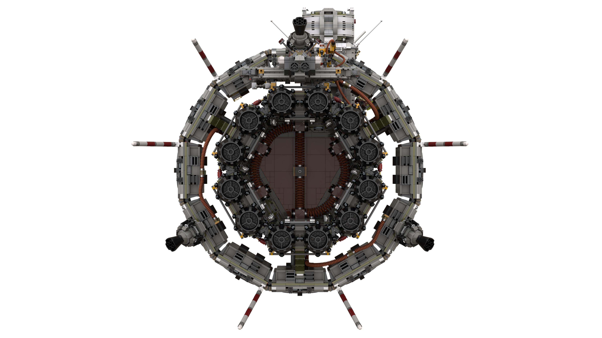

# Erimos IV Mission 08 Preparation with the Roc Heavy Cargo Shuttle and LSS Notus (`RP-08-pre`)

[home](../../README.md)

## Phoenix Station Spaceport (Pad 3)

## Roc Docked with LSS Notus

## LSS Notus Engine Pod

## Animation

[home](../../README.md)