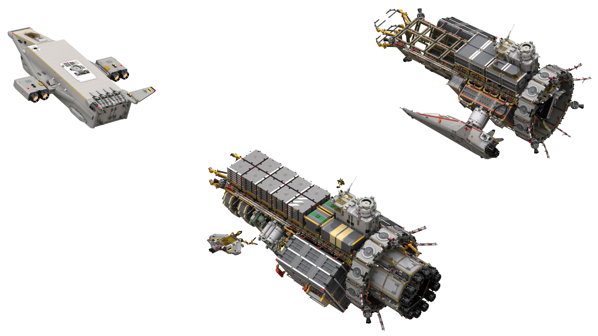

# Red Planet Mission 06 Space Renders

[back](../README.md)

## Panoramas

## Arrival at Erimos IV

## Roc Heavy Cargo Shuttle Departing for Surface

## Lagrange Point 2 Refueling Station Upgrades

## Lagrange Point 5 Subspace Antenna 2 (experimental) Upgrade

[back](../README.md)
